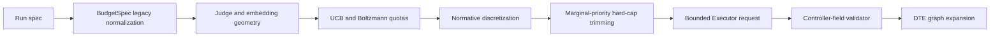

# P0 Budget and Executor Boundary Design

## Overview

The implementation remains inside the existing Pydantic models, deterministic
math engine, runner, adapter validator, and semantic cache. No new runtime or
workflow framework is introduced. The design follows the updated repository
specification and issue #2: DTE remains the only allocation and graph authority.

Repository inspection found that budget consumption is centralized in
`BudgetSpec`, `allocate_frontier()`, and `run_frontier_search()`; both executor
APIs already converge on `validate_adapter_output()`; and persistent/in-memory
caches share the same content-only key functions. These are the narrow change
points used below.

## Architecture

The UCB formula and role ordering are unchanged. Cache namespaces are structured
metadata included in the hashed JSON envelope, separate from semantic content.

## Components and Interfaces

### Budget model

`BudgetSpec` exposes only `allocation_mass_per_iteration` and
`max_children_per_iteration`. A `mode="before"` validator copies the deprecated
legacy value into the canonical allocation field, removes the legacy key, and
rejects unequal dual input. Canonical serialization follows automatically.

### Allocation engine

The math engine separates quota discretization from Boltzmann probability
calculation. Tentative allocations use `floor(q + 0.5)` below one and `ceil(q)`
at or above one. If trimming is required, each tentative child becomes a slot
sorted by:

1. descending `q_i - (r - 1)`;
2. descending allocation value;
3. ascending node ID;
4. ascending slot index.

The retained slot counts form final per-node allocations. `allocate_frontier()`
passes node IDs and both budget parameters explicitly.

### Executor validator

Raw dictionaries are rejected when any controller-owned key is present,
regardless of value. Parsed `SearchNode` objects are converted through a helper
that checks `model_fields_set`, allowing implicit defaults while rejecting fields
that the adapter explicitly supplied. Both the function and legacy class APIs use
this single path.

### Cache namespace

Frozen namespace data classes define embedding and Judge identities. Key hashes
contain `{namespace, payload}` rather than concatenated strings. Embedding calls
derive provider, model/snapshot, dimension, and contract version from the active
provider. The deterministic Judge uses an explicit fixed namespace; future
callers can supply another namespace. Existing cache files retain old entries,
which are no longer addressable by the new keys.

## Data Models

- `allocation_mass_per_iteration: int`, default 3, range matching the legacy
  allocation field.
- `max_children_per_iteration: int`, default 5, positive hard per-iteration cap.
- `EmbeddingCacheNamespace`: provider, model snapshot, dimension, contract version.
- `JudgeCacheNamespace`: model snapshot, reasoning profile, rubric version,
  prompt version, output schema version.

No EpisodeRequest, graph revision, ledger, or evaluator models are added.

## Error Handling

- Conflicting legacy/canonical budget values raise a Pydantic validation error
  naming both fields.
- Missing node IDs or mismatched allocation arrays raise `ValueError` before
  trimming.
- Any explicitly supplied controller field raises `ValueError` naming the field.
- Existing synthesis/frontier/parent/count validation remains fail-fast.
- Guard failure stops delivery; no issue checklist item is marked complete until
  its implementation and tests pass.

## Testing Strategy

- Unit-test quota rounding, the normative example, cap trimming, and permutation
  invariance.
- Test legacy mapping, conflicting dual input, canonical dump, and schema/examples.
- Test raw and parsed Executor outputs, including null/zero controller fields and
  a valid legacy object adapter.
- Test namespace-sensitive in-memory and file cache behavior.
- Run all DTE guards, the complete pytest suite, `git diff --check`, legacy-name
  scanning, and final diff review before commits and push.
