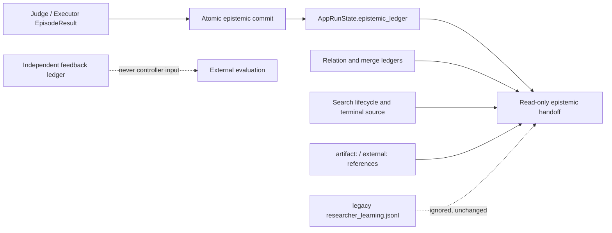

# Design: Provenance-Only Epistemic Observability

## Overview

The change removes researcher-learning and human-confirmation semantics from
the current DTE contract while retaining the committed epistemic dependency
graph and read-only terminal handoff. The design deliberately avoids changing
the persisted `external_artifact_backed` token because it participates in old
EpisodeResult hashes and App state validation. Human-readable surfaces instead
render it as `artifact_referenced` and explain its non-verifying meaning.

Key repository findings informing the design:

- episode commit already restricts current producers to `agent_reported` and
  `external_artifact_backed`;
- learning is implemented as a separate JSONL reader/writer plus CLI, but its
  IDs are also accepted by epistemic reference validation;
- the terminal handoff currently joins that external learning ledger and
  exposes human counts in provenance and correlated-error summaries;
- `_search_dispositions()` recognizes `max_iterations` but not PR #20's
  `max_search_nodes` terminal source;
- continuation consumes the committed epistemic ledger only and must retain
  its current persisted source token and material-yield behavior.

## Architecture

The current DTE authority boundary ends at provenance and uncertainty. Artifact
contents, formal calculations, literature applicability, scientific truth, and
the researcher's judgment are external processes.

## Components and Interfaces

### Epistemic models

- Remove learning record/diagnostic/source models and handoff fields.
- Remove current `human_confirmed` source and count fields.
- Exclude the retired source from current schemas. Read-only summary loading
  isolates an affected legacy contribution bundle in an in-memory copy and
  reports a data-quality limitation; persisted bytes remain unchanged.
- Keep the persisted artifact source value; define a renderer mapping to
  `artifact_referenced`.

### Commit boundary

- Remove learning IDs from `EpistemicReferenceContext`.
- Reject every new `learning:` reference explicitly.
- Preserve all existing authority, lifecycle, artifact-path, and atomicity
  checks.

### Epistemic read model

- Delete learning-ledger read/repair/append code and all joins to handoff/data
  quality.
- Ignore an old `epistemic/researcher_learning.jsonl` without opening or
  changing it.
- Treat legacy human-source records as a partial legacy limitation, not an
  authenticated source; omit the affected old contribution bundle from the
  current projection without modifying its stored value on disk.
- Render artifact provenance with the non-verifying display label.
- Classify frontier paths under `max_iterations` and `max_search_nodes` as
  `out_of_budget`, without producing an epistemic disposition.

### CLI and documentation

- Remove `record-learning` parser, handler, imports, help, docs, and tests.
- Keep `record-feedback` untouched.
- Update SPEC, architecture, workflow, README, SKILL, and AGENTS to state that
  DTE preserves provenance and uncertainty but does not verify scientific
  truth or human learning.

## Data Models

- Current contribution source type:
  `agent_reported | external_artifact_backed`.
- Read-only compatibility recognizes the deprecated token only in raw legacy
  input, isolates the affected bundle before current-model parsing, and adds a
  data-quality limitation. The current model schema does not expose the token.
- `SourceProvenanceSummaryV1` retains agent, artifact-reference, and
  backend-derived counts only.
- `EpistemicIndependenceSummaryV1` retains correlated-error indicators and an
  artifact-reference coverage count; it has no human count or correctness
  score.
- `TerminalEpistemicHandoffV1` has no `researcher_learning` field.
- `EpistemicDataQualityV1` has no learning-ledger diagnostics.

This is a compatible cleanup of current output models. If removing fields from
the formal handoff changes its schema shape, schema/version fixtures are updated
in lockstep. Old run state remains untouched because handoffs are derived
outputs and no read-time migration writes files.

## Error Handling

- Current `human_confirmed` episode contributions fail schema validation before
  commit when possible; defensive commit validation remains fail-closed.
- New `learning:` references fail with an explicit unsupported-reference error.
- Old human-source ledger records are isolated from the current in-memory
  projection and cause `partial` data quality with a clear deprecated-source
  limitation; the source file is not rewritten.
- Missing artifact files remain provenance/data-quality limitations; they never
  become correctness verdicts.
- Summary generation never repairs or rewrites state or old learning files.

## Testing Strategy

- Update schema equality and round-trip fixtures.
- Cover current producer acceptance for agent/artifact sources and rejection
  for human sources and learning references.
- Verify old learning files are byte-identical and absent from summaries.
- Verify legacy human records produce a limitation without source conversion.
- Verify renderer uses `artifact_referenced` and contains no verified/confirmed
  claim language.
- Verify `max_search_nodes` and `max_iterations` map frontier paths to
  `out_of_budget`, while other terminal sources do not.
- Run the full pytest suite, both smoke workflows, all role/spec guards,
  schema/prompt matrices, and `git diff --check`.
- Add an epistemic smoke path reaching `max_search_nodes` with an artifact
  reference and assert summary generation leaves graph/controller state
  unchanged.
